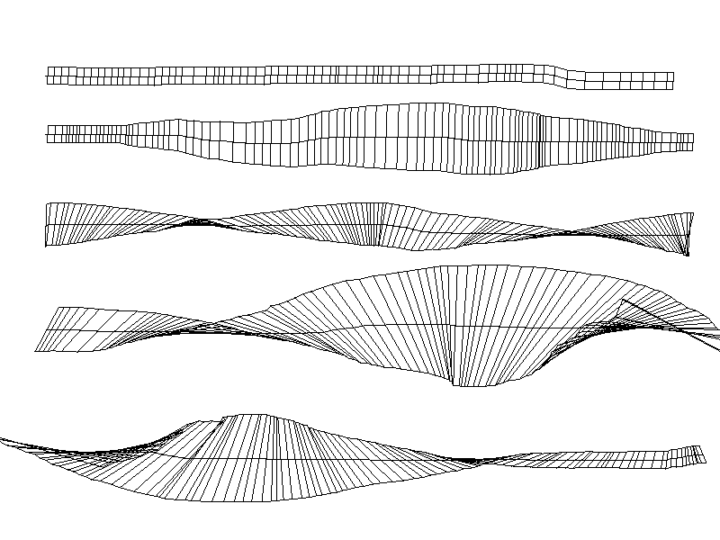
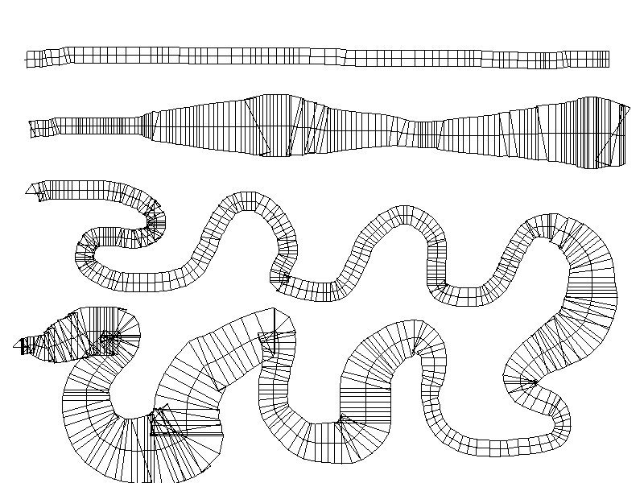

## IfThenPaint Brush Simulator

IfThenPaint Brush Simulator is a small PyQt5 desktop app that lets you experiment with a “brush” made from thin line stamps. You can rotate, resize, and change the thickness of the stamped line, switch between flat and round brush behaviors, and export the exact geometry of each stroke to JSON.

### Flat Brush Example


### Round Brush Example


### Features

- **Interactive brush preview**
  - Always-visible cursor guide line matching the current brush size and orientation.
  - Adjustable **stamp thickness** (1 px or 10 px) that affects both the preview and the stamped line.

- **Two brush types**
  - **Flat**: brush line orientation is controlled manually with the keyboard.
  - **Round**: brush line is always **perpendicular to the drawn path** while drawing, and remains perpendicular to the last path when idle.

- **Keyboard controls**
  - **Left / Right Arrow**: rotate the brush line continuously.
  - **Up / Down Arrow**: increase / decrease brush size (affects line length and overall brush footprint).

- **Menus**
  - **File**
    - **Save Image** (`Ctrl+S`): save the current canvas as PNG/JPEG.
    - **Export Paths** (`Ctrl+E`): export all stroke geometry to a JSON file.
    - **Clear** (`Ctrl+C`): clear the canvas and reset accumulated paths.
  - **Brush Type**
    - **Flat**, **Round** (with checkmark showing current selection).
  - **Stamp Thickness**
    - **1 px**, **10 px** (with checkmark showing current selection).
  - **Brush Color**
    - **Black**, **Green**, **Yellow**, **Blue**, **Red** (with checkmark for the active color).

- **Path export**
  - Every stroke (mouse press → mouse release) is recorded as a **path**.
  - Exported JSON structure:

    ```json
    {
      "paths": [
        {
          "brush_type": "Flat",
          "brush_size": 20,
          "stamp_thickness": 1,
          "color": "#000000",
          "center_points": [[x1, y1], [x2, y2], "..."],
          "top_points": [[x1, y1], "..."],
          "bottom_points": [[x1, y1], "..."]
        }
      ]
    }
    ```

### Running from source

Requirements (see `pyproject.toml`):

- Python 3.11+ recommended
- `PyQt5<=5.15.11`

Install dependencies (using `pip`):

```bash
pip install "PyQt5<=5.15.11"
```

Run the app:

```bash
python main.py
```